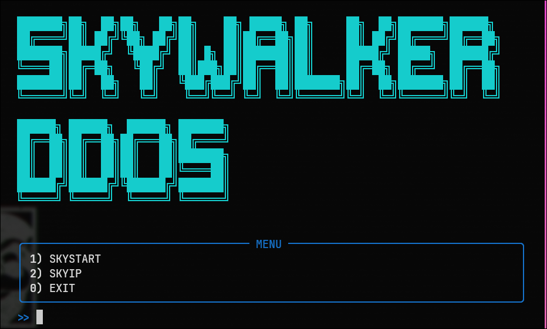

# SKYWALKER DDOS — Terminal Visual (Python)

My personal Python development – ​​**a visual DDoS attacker**. **If I get more than one star, I might drop a real DDoS attack.**

---

## Screenshot




---

## Dependencies (Arch Linux)

Installation via pacman:

```bash
sudo pacman -S python python-rich python-pyfiglet